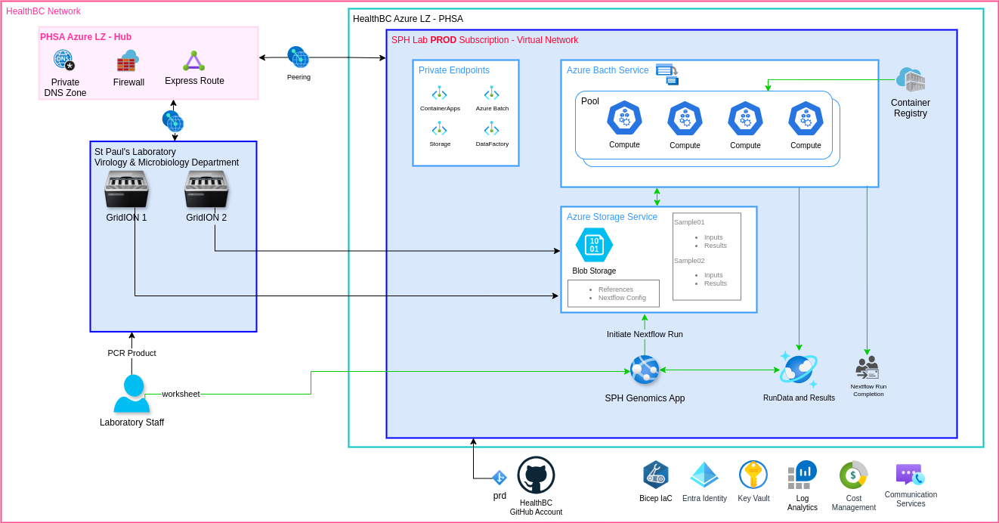

# Secured Nextflow Deployment

## Architecture



- Two storage accounts are deployed and used for:
  - Pipelines' assets and source code: hierarchial namespace (HNS) is disabled for this storage account to be able to enable versioning on the pipeline assets.
  - Nextflow references and I/O files: ADLS Gen2 is used to allow for enabling file-level access controls.

- Two Batch Pools are used:
  - Nextflow Runners: small VM for running the nextflow execution commands
  - Pipeline Runners: larger VMs for running the pipeline tasks

## Assumptions on Exsisting Resources

Following resources are assumed to exist as part of an Enterprise Landing Zone and not included in the bicep templates:

- Virtual Network and peering with the hub or other means of connection to on-premesis network.
- Private Endpints Subnet.
- DNS Zones and Records for private endpoints.

For a complete deployment of Secured Batch see for example: [Batch Accelerator](https://github.com/Azure/bacc).

## Deployment Steps

- login to Azure
  
  ```s
  az login
  
  ```

- create a resource group
  
  ```s
  export RESOURCE_GROUP_NAME="genomics-nf-blog"
  export LOCATION="canadacentral"
  az group create --name $RESOURCE_GROUP_NAME --location $LCOATION
  ```

- modify the default values of the parameters and deploy the [bicep template](infra/main.bicep) template and then run the command:

  ```s
  az deployment group create --resource-group $RESOURCE_GROUP_NAME --template-file infra/main.bicep
  
  ```

- build and push the custom image to ACR
  
  The [Dockerfile](Dockerfile) is used to build a custom image built from the official nextflow image plus the required python libraries. This image will be used by the Nextflow headnodes to run the pipelines.

  ```s
  export ACR_NAME="genomicsacrdev01"
  export IMAGE_NAME="nf-batch"
  export IMAGE_TAG="1.0"
  export IMAGE_TAG="$ACR_NAME.azurecr.io/$IMAGE_NAME:$IMAGE_TAG"

  az acr login --name $ACR_NAME
  docker build . -t $IMAGE_TAG
  docker push $IMAGE_TAG
  ```

### Git Action

A git action is setup using the [deploy-infrastructure.yaml](.github/workflows/deploy-infrastructure.yaml).

- To use this Git Action, a self-hosted runner within the network (on Azure or on-premesis) is required.
- Set up the credentials in Github secrets following the [documentation](https://learn.microsoft.com/en-us/azure/azure-resource-manager/bicep/deploy-github-actions?tabs=CLI%2Copenid#generate-deployment-credentials).
- The deployment pipeline can be triggered by a push commit or manually from the Github website.

## Run Nextflow Pipeline

A sample Nextflow pipeline is included under the [nextflow](nextflow/) folder. To run this pipeline:

1. Upload [samples](samples) folder to the I/O Storage Account under `nextflow` blob container.
2. Set the following environment variables in your terminal:

    | Variable | Description |
    |----------|-------------|
    | `RESOURCE_GROUP` | The name of the Azure resource group where resources are deployed |
    | `BATCH_ACCOUNT_URL` | The URL endpoint of the Azure Batch account |
    | `BATCH_ACCOUNT_NAME` | The name of the Azure Batch account |
    | `POOL_ID` | The ID of the Batch Nextflow Healdnodes pool |
    | `STORAGE_ACCOUNT_NAME` | The name of the storage account used for pipeline I/O |
    | `AUTOSTORAGE_ACCOUNT_NAME` | The name of the storage account used for pipeline assets |
    | `KEYVAULT_NAME` | The name of the Key Vault storing secrets and certificates |
    | `CONTAINER_NAME` | The name of the container registry where the Nextflow image and other images used in pipeline tasks are stored |
    | `LOCAL_FOLDER_PATH` | The local path where Nextflow Pipeline files are located |
    | `MANAGED_IDENTITY_RESOURCE_ID` | The resource ID of the User Managed Identity used by Batch Account and Pool Nodes to access Storage and Key Vault. Must be in the format: `/subscriptions/<subscription id>/resourcegroups/<resource group name>/providers/Microsoft.ManagedIdentity/userAssignedIdentities/<user managed identity name>` |
    | `OUTPUT_PATH` | The path in the I/O Storage Account where pipeline outputs of the run will be stored |

3. Set the values for storage account name, batch account name, and registry server in the [nexyflow.config](nextflow/nextflow.config) file.
4. use [submit_job.py](submit_job.py) script to upload nextflow pipeline codes, and define and submit a batch job to run the pipeline.
   - Blob Data Contributor/Owner role plus Batch Account Contributor/Owner role are required to run this script.
5. check the I/O storage account for the results once the batch job is completed.

**Note**: Since we are using bicep to deploy batch pools, Nextflow pipeline processes must have the `queue` directive set to the pool id. Also, the container images must be explicitly included with the `container` directive.

## Improvement Opportunities

- Use managed identity in Nextflow Config instead of secrets.
